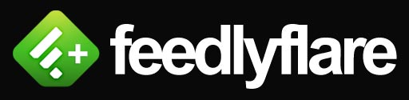

> Important Note: I no longer use Feedly so if errors occur I will not see them, which means if you are using this and notice an issue please let me know so I can fix it...otherwise I won't ever see it and thus won't be fixed.
>
> To inform me of an error please [submit an issue here on GitHub](https://github.com/MichaelTunnell/feedly-feedlyflare/issues) or tweet to me [@MichaelTunnell](https://twitter.com/michaeltunnell).

- [Description](#description)
- [Project Details](#details)
- [Installation](#install)
- [Video](#video)

## FeedlyFlare - Feedly Feedflare for Feedburner

Feedlyflare adds a 1-Click Button to a FeedBurner feed to allow people to easily subscribe to it via [Feedly](http://feedly.com/).

#### Project Details

Version: 2.0.1

Updated: January 5th, 2017

[Changelog](CHANGELOG.md) | [RSS Feed](https://github.com/MichaelTunnell/feedly-feedlyflare/commits/master.atom)

#### Installation

Installation Instructions:

1. Sign into FeedBurner and click the title of the feed you want to modify on My Feeds.
1. Click **Optimize** and then choose the **BrowserFriendly** option from the left-side service menu.
1. Click the **More subscription options** link.
1. Type in the feedlyflare.xml URL that you want, **http://example.com/feedlyflare.xml** into the text box and click **Add ↑**.
1. The Feedly feedflare should appear in the list above. Click the checkbox next to it to activate the unit.
1. Click **[Save]** to save your changes.

- View your feed in a browser. You should now see the Feedly feedflare in the Subscribe Now! section of your feed.

#### Video

